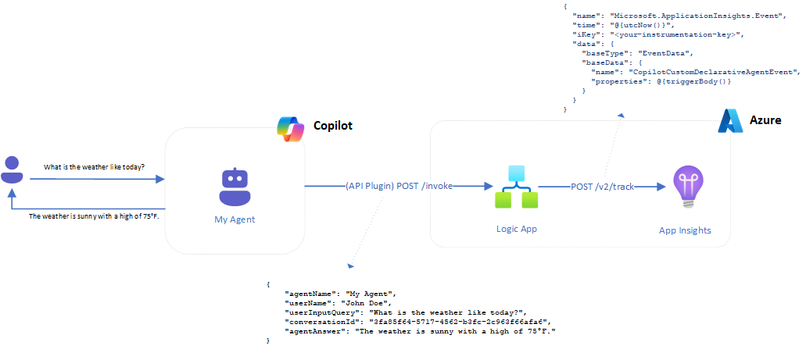
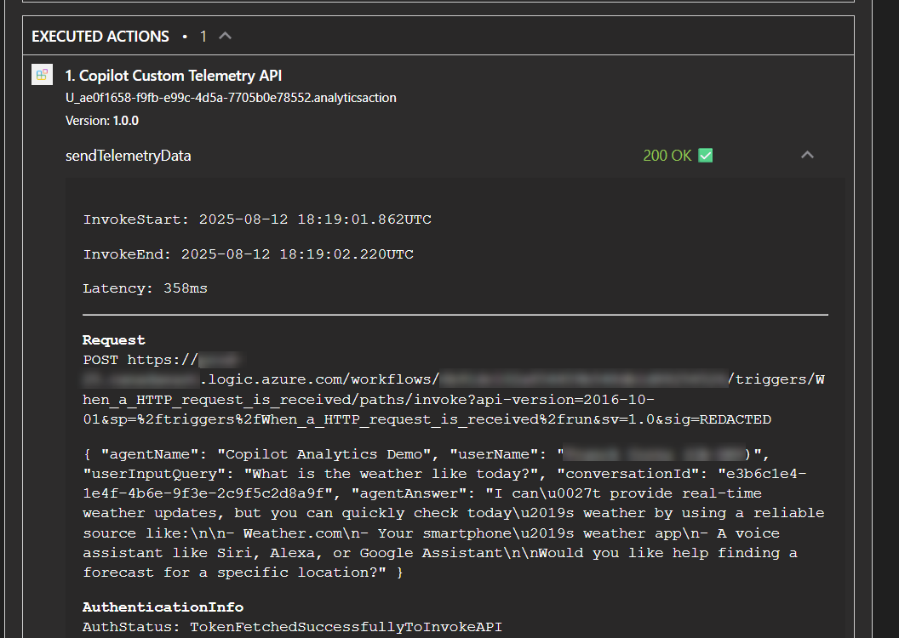
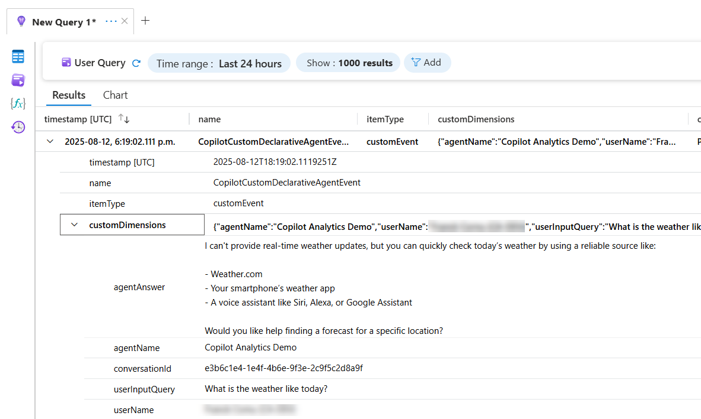

# Monitor your Copilot declarative agents using TypeSpec and Application Insights

## Summary

This sample demonstrates how to integrate Azure Application Insights into existing Copilot "pro-code" declarative agents using TypeSpec and API plugins. This generic approach, combined with strategic prompting techniques, enables us to capture meaningful metrics for declarative agents.

The following blog post describes the complete solution setup: [https://blog.franckcornu.com/post/add-app-insights-procode-copilot-da](https://blog.franckcornu.com/post/add-app-insights-procode-copilot-da)







## Contributors

* [Franck Cornu](https://github.com/FranckyC)- M365 Development/Copilot extensibility MVP
## Version history

Version|Date|Comments
-------|----|--------
1.0|August 12, 2025|Initial solution

## Prerequisites

- [Microsoft agents toolkit Visual Studio Code Extension](https://marketplace.visualstudio.com/items?itemName=TeamsDevApp.ms-teams-vscode-extension)
- [Microsoft 365 Copilot license](https://learn.microsoft.com/microsoft-365-copilot/extensibility/prerequisites#prerequisites)
- A [Microsoft 365 account for development](https://docs.microsoft.com/microsoftteams/platform/toolkit/accounts).
- Azure environment

## Minimal path to awesome

1. Clone this repository
2. In Azure, create a new Azure Logic App as mentionned here:  [https://blog.franckcornu.com/post/add-app-insights-procode-copilot-da](https://blog.franckcornu.com/post/add-app-insights-procode-copilot-da)
3. In the `env.dev` file, fill the following values extracted from the Logic App HTTP Trigger URL:


```text
LOGIC_APP_SERVER_URL= #Example: https://prod-27.<region>.logic.azure.com:443
LOGIC_APP_INVOKE_PATH=/workflows/<GUID>/triggers/<trigger_name>/paths/invoke
LOGIC_APP_TRIGGER_PATH=/triggers/<trigger_name>/run
```

4. From Microsoft 365 Agents Toolkit, sign-in to your Microsoft 365 account.
5. From Microsoft 365 Agents, provision the solution to create the Teams app.
5. Go to [https://www.office.com/chat?auth=2](https://www.office.com/chat?auth=2) URL and enable the developer mode by using the `-developer on` prompt.
7. Ask a question like _"What are my latest documents?"_. You should see the plugin triggered and data sent to the Logic App/Application Insights.

## Features

The following sample demonstrates the following concepts:
- Use Logic App as an API plugin by using specific endpoint and instructions.
- Pass parameter from the LLM context

<!--
RESERVED FOR REPO MAINTAINERS

We'll add the video from the community call recording here

## Video

[](https://www.youtube.com/watch?v=XXXXX "YouTube video title")
-->

## Help

Search for:
da-appinsights-plugin-typespec

Search for:
@FranckyC

We do not support samples, but this community is always willing to help, and we want to improve these samples. We use GitHub to track issues, which makes it easy for  community members to volunteer their time and help resolve issues.

You can try looking at [issues related to this sample](https://github.com/pnp/copilot-pro-dev-samples/issues?q=label%3A%22sample%3A%20da-appinsights-plugin-typespec%22) to see if anybody else is having the same issues.

If you encounter any issues using this sample, [create a new issue](https://github.com/pnp/copilot-pro-dev-samples/issues/new).

Finally, if you have an idea for improvement, [make a suggestion](https://github.com/pnp/copilot-pro-dev-samples/issues/new).

## Disclaimer

**THIS CODE IS PROVIDED *AS IS* WITHOUT WARRANTY OF ANY KIND, EITHER EXPRESS OR IMPLIED, INCLUDING ANY IMPLIED WARRANTIES OF FITNESS FOR A PARTICULAR PURPOSE, MERCHANTABILITY, OR NON-INFRINGEMENT.**


