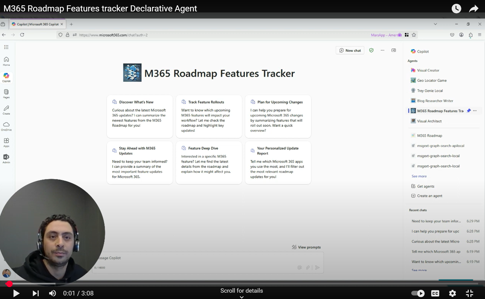

# M365 Roadmap Features Tracker declarative agent

## Summary

The M365 Roadmap Features Tracker agent shows how users can easily stay up to date with the latest Microsoft 365 roadmap features. It integrates a Microsoft Graph Connector to monitor and deliver the latest updates, offering a hands-free solution for staying informed.

The agent uses a Microsoft Graph Connector that ingests Microsoft 365 roadmap features. This connector serves as a knowledge base to keep teams informed about updates on Microsoft 365 Roadmap features, facilitating proactive adaptation to changes, new releases, and deployments across Microsoft Teams, SharePoint, Outlook, and more.

## Overview

[](https://youtu.be/3zBANCzFcpM)

## Prerequisites

- [Teams Toolkit Visual Studio Code Extension](https://aka.ms/teams-toolkit) version 5.0.0 and higher or [Teams Toolkit CLI](https://aka.ms/teamsfx-toolkit-cli)
- [Microsoft 365 Copilot license](https://learn.microsoft.com/microsoft-365-copilot/extensibility/prerequisites#prerequisites)
- [Microsoft 365 account for development](https://docs.microsoft.com/microsoftteams/platform/toolkit/accounts).


## Minimal path to awesome

* Clone this repository (or [download this solution as a .ZIP file](https://pnp.github.io/download-partial/?url=https://github.com/pnp/copilot-pro-dev-samples/tree/main/samples/da-qna-graphapi-plugin) then unzip it)


* Clone this repository and follow the minimal path to awesome in order to Ingest M365 Roadmap content in Microsoft 365
- [Ingest M365 Roadmap content in Microsoft 365 using Microsoft Graph connectors using C# and .NET](https://github.com/pnp/graph-connectors-samples/tree/main/samples/dotnet-csharp-m365-roadmap)

* Change the `connection_id` of the capabilities section in the declarativeAgent.json
If you are going to use sample of ingesting Microsoft 365 roadmap as is, then the connection id will be `roadmapmicrosoft365`

```
 "capabilities": [
    {
      "name": "GraphConnectors",
      "connections": [
        {
          "connection_id": "<replace_with_connection_id>"
        }
      ]
    }
  ]
```

Follow the steps to deploy your agent
1. First, select the Teams Toolkit icon on the left in the VS Code toolbar.
2. In the Account section, sign in with your [Microsoft 365 account](https://docs.microsoft.com/microsoftteams/platform/toolkit/accounts) if you haven't already.
3. Create Teams app by clicking `Provision` in "Lifecycle" section.
4. Select `Preview in Copilot (Edge)` or `Preview in Copilot (Chrome)` from the launch configuration dropdown.
5. Once the Copilot app is loaded in the browser, click on the "…" menu and select "Copilot chats". You will see your declarative agent on the right rail. Clicking on it will change the experience to showcase the logo and name of your declarative agent.
6. Ask a question to your declarative agent and it should respond based on the instructions provided.

## Tools and Frameworks


## What's included in the template

| Folder       | Contents                                                                                 |
| ------------ | ---------------------------------------------------------------------------------------- |
| `.vscode`    | VSCode files for debugging                                                               |
| `appPackage` | Templates for the Teams application manifest, the GPT manifest and the API specification |
| `env`        | Environment files                                                                        |

The following files can be customized and demonstrate an example implementation to get you started.

| File                               | Contents                                                                     |
| ---------------------------------- | ---------------------------------------------------------------------------- |
| `appPackage/declarativeAgent.json` | Define the behaviour and configurations of the declarative agent.            |
| `appPackage/manifest.json`         | Teams application manifest that defines metadata for your declarative agent. |

The following are Teams Toolkit specific project files. You can [visit a complete guide on Github](https://github.com/OfficeDev/TeamsFx/wiki/Teams-Toolkit-Visual-Studio-Code-v5-Guide#overview) to understand how Teams Toolkit works.

| File           | Contents                                                                                                                                  |
| -------------- | ----------------------------------------------------------------------------------------------------------------------------------------- |
| `teamsapp.yml` | This is the main Teams Toolkit project file. The project file defines two primary things: Properties and configuration Stage definitions. |


## Contributors

* [Mohammad Amer](https://github.com/mohammadamer) - M365 Development MVP

## Version history

Version|Date|Comments
-------|----|--------
1.0|March 10, 2025|Initial solution
1.0|April 06, 2025|Enhanced the agent instructions


## Addition information and references

- [Declarative agents for Microsoft 365](https://aka.ms/teams-toolkit-declarative-agent)

