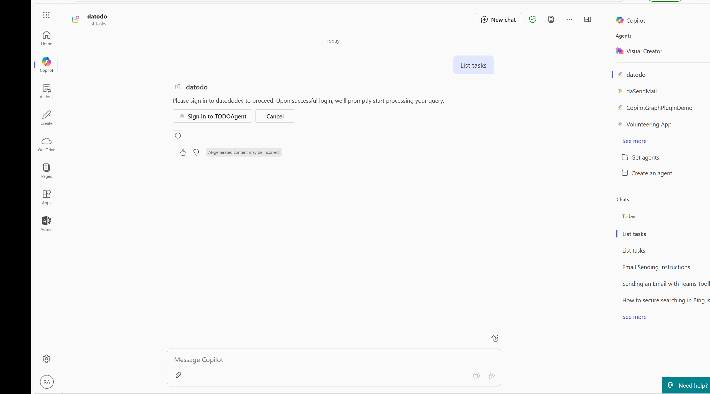

# Use the Microsoft Graph API as a Copilot plugin for a declarative agent to get ToDo tasks

## Summary

This sample demonstrates how to use the Microsoft Graph API as a Copilot plugin in a declarative agent with some variation from the blog post
 [https://blog.franckcornu.com/post/copilot-graph-api-qna-plugin/](https://blog.franckcornu.com/post/copilot-graph-api-qna-plugin) focusing this time how to list my ToDo tasks since the QnA feature has retired since March 2025.

The following blog post describes the complete solution setup:[Building a Copilot Agent with Teams Toolkit and Microsoft Graph Plugin to list my ToDo Tasks](https://reshmeeauckloo.com/posts/copilot-agent-teamstoolkit-m365graph-plugin/)




## Contributors

* [Reshmee Auckloo](https://github.com/reshmee011)- M365 Development MVP

## Version history

Version|Date|Comments
-------|----|--------
1.0|April 18, 2025|Initial solution

## Get started with the template

> **Prerequisites**
>
> To run this app template in your local dev machine, you will need:
>
> - [Node.js](https://nodejs.org/), supported versions: 18, 20, 22
> - A [Microsoft 365 account for development](https://docs.microsoft.com/microsoftteams/platform/toolkit/accounts).
> - [Teams Toolkit Visual Studio Code Extension](https://aka.ms/teams-toolkit) version 5.0.0 and higher or [Teams Toolkit CLI](https://aka.ms/teamsfx-toolkit-cli)
> - [Microsoft 365 Copilot license](https://learn.microsoft.com/microsoft-365-copilot/extensibility/prerequisites#prerequisites)

## Minimal path to awesome

* Clone this repository (or [download this solution as a .ZIP file](https://pnp.github.io/download-partial/?url=https://github.com/pnp/copilot-pro-dev-samples/tree/main/samples/da-todo-listtasks-graphapi-plugin) then unzip it)

* Open the **todoaction-openapi.yml** file, look for the `securitySchemes` property and replace `tenantid` by your own ID:

    ```yaml
      securitySchemes:
    azureaadv2:
      type: oauth2
      flows:
        authorizationCode:
          authorizationUrl: https://login.microsoftonline.com/39f0e149-6ce0-483e-8acf-b6faa229a203/oauth2/v2.0/authorize
          tokenUrl: https://login.microsoftonline.com/39f0e149-6ce0-483e-8acf-b6faa229a203/oauth2/v2.0/token
          scopes:
            User.Read: 'Read user profile'
            Directory.Read.All: 'Read directory data'
            Tasks.ReadWrite: 'Read and write all tasks'
    ```

* Register an Entra ID application in Azure and add the API permissions `Tasks.ReadWrite,User.Read,Directory.Read.All` (delegated). Add the `https://teams.microsoft.com/api/platform/v1.0/oAuthRedirect` as a redirect URL for web platform in the **Authentication** settings.

2. In the [Teams developer portal](https://dev.teams.microsoft.com/), add a new OAuth client registration and register a new client with the following information (replace `tenantid` by your own value):

    **App settings**

    - **Registration name**: ToDo
    - **Base URL**: `https://graph.microsoft.com/beta` (QnA are only usable through the beta endpoint)
    - **Restrict usage by org**: My organization only
    - **Restrict usage by app**: Any Teams app (when agent is deployed, use the Teams app ID).

    **OAuth settings**
    - **Client ID**: &lt;the entra ID application ID&gt;
    - **Client secret**: &lt;the Entra ID application secret&gt;
    - **Authorization endpoint**: https://login.microsoftonline.com/tenantid/oauth2/v2.0/authorize
    - **Token endpoint**: https://login.microsoftonline.com/tenantid/oauth2/v2.0/token
    - **Refresh endpoint**: https://login.microsoftonline.com/tenantid/oauth2/v2.0/refresh
    - **Scope**: Tasks.ReadWrite,User.Read,Directory.Read.All

    Save the information. A new OAuth registration key will be generated.

3. Open the **ai-plugin.json** file and replace the auth property by the following, using the key from the previous step. You can also use the `${{OAUTH2_REGISTRATIONKEY}}` token defined the `.env.dev` file: 

    ```json
    "auth": {
        "type": "OAuthPluginVault",
        "reference_id": "ZTRhNDM5YjQtM2..."
    },
    ```
4. From Teams Toolkit, sign-in to your Microsoft 365 account.
5. From Teams Toolkit, provision the solution to create the Teams app.
5. Go to [https://www.office.com/chat?auth=2](https://www.office.com/chat?auth=2) URL and enable the developer mode by using the `-developer on` prompt.
7. Ask a question like _"List My Tasks"_. You should see the plugin triggered.

## Features

The following sample demonstrates the following concepts:
- Use Microsoft Graph API as an API plugin by using specific endpoint and instructions.
- Query the QnA content from Microsoft Search and use it for Copilot answers.

<!--
RESERVED FOR REPO MAINTAINERS

We'll add the video from the community call recording here

## Video

[](https://www.youtube.com/watch?v=XXXXX "YouTube video title")
-->

## Help

We do not support samples, but this community is always willing to help, and we want to improve these samples. We use GitHub to track issues, which makes it easy for  community members to volunteer their time and help resolve issues.

You can try looking at [issues related to this sample](https://github.com/pnp/copilot-pro-dev-samples/issues?q=label%3A%22sample%3A%20da-qna-graphapi-plugin%22) to see if anybody else is having the same issues.

If you encounter any issues using this sample, [create a new issue](https://github.com/pnp/copilot-pro-dev-samples/issues/new).

Finally, if you have an idea for improvement, [make a suggestion](https://github.com/pnp/copilot-pro-dev-samples/issues/new).

## Disclaimer

**THIS CODE IS PROVIDED *AS IS* WITHOUT WARRANTY OF ANY KIND, EITHER EXPRESS OR IMPLIED, INCLUDING ANY IMPLIED WARRANTIES OF FITNESS FOR A PARTICULAR PURPOSE, MERCHANTABILITY, OR NON-INFRINGEMENT.**


